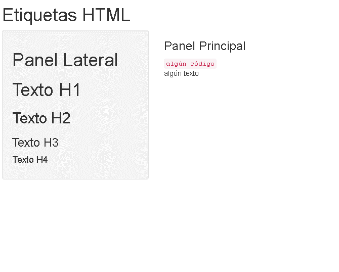

## Qué es Shiny?

- Shiny es una plataforma para generar aplicaciones web basados en la funcionalidad de R.
- Suponga que se crea un algoritmo de predicción, es posible desde Shiny crear una pagina Web que permita introducir las variables predictivas, posteriormente, a través de R, obtener el resultado de la predicción.
- Permite crear páginas Web de una manera simple efectiva y aun así bastante poderosa.
  - Sin embargo, para brindarle flexibilidad a la herramienta es necesario tener conocimientos en otros lenguajes

## Algunos Prerequisitos 
- Shiny no requiere conocimientos especifico en programación Web, sin embargo, nociones de html, css y js son de gran ayuda
  - html da la estructura de la pagina web
  - css da el estilo de la aplicación
  - js toda la interactividad de la pagina
- Shiny usa [bootstrap](http://getbootstrap.com/) lo cual brinda la posibilidad de visualizar la aplicación en diferentes formatos.

## Pasos Iniciales
- Asegúrese de contar con la ultima versión de R instalada `session_info()`
- Verificar que el paquete shiny esté instalado
- `install.packages("shiny")`
- `library(shiny)`
- `packageVersion("shiny")`
- Tener la documentación [http://shiny.rstudio.com/tutorial/](http://shiny.rstudio.com/tutorial/) a la mano

## Elementos de un Proyecto Shiny
- Un proyecto de shiny es un directorio que contiene
  - Sección ui.R (interfaz de usuario) controla la visualización de la aplicación.
  - Sección server.R controla la funcionalidad de la aplicación.
  - Sección global.R (opcional) ejecuciones de código previas a la aplicación


## ui.R
```
library(shiny)
shinyUI(pageWithSidebar(
  headerPanel("Hola Mundo!!!"),
  sidebarPanel(
    h3('Barra lateral')
  ),
  mainPanel(
      h3('Panel Princiapl')
  )
))
```

## server.r
```
library(shiny)
shinyServer(
  function(input, output) {
  }
)
```

## global.r
```
library(shiny)
library(dplyr)
data(iris)
```

## Para ejecutar
- En R, cambie al directorio con los archivos mencionados y digite `runApp()`
- Incluya la ruta del directorio dentro de la función
- Debe abrir un "explorador" con la aplicación
- Mediante el comando `shinyApp(ui, server)`

## Ejemplo
```{r, out.width = "800px", out.height="500px", echo=FALSE, fig.align='center'}

```

## Funciones en R para manipulacion de etiquetas HTML
`ui.R`
```
shinyUI(pageWithSidebar(
  headerPanel("Etiquetas HTML"),
  sidebarPanel(
      h1('Panel Lateral'),
      h1('Texto H1'),
      h2('Texto H2'),
      h3('Texto H3'),
      h4('Texto H4')
      
  ),
  mainPanel(
      h3('Panel Principal'),
      code('algún código'),
      p('algún texto')
  )
))

```

## Ejemplo
```{r, out.width = "800px", out.height="500px", echo=FALSE, fig.align='center'}

```

## Inputs en ui.R
```
shinyUI(pageWithSidebar(
  headerPanel("Inputs en R"),
  sidebarPanel(
    numericInput('id1', 'Input Numérico 1', 0, min = 0, max = 10, step = 1),
    checkboxGroupInput("id2", "Checkbox",
                   c("Valor 1" = "1",
                     "Valor 2" = "2",
                     "Valor 3" = "3")),
    dateInput("Fecha", "Date:")  
  ),
  mainPanel(
      
  )
))
```

## Ejemplo
```{r, out.width = "800px", out.height="500px", echo=FALSE, fig.align='center'}

```


## Panel Prinicipal en ui.R
```
  mainPanel(
        h3('Ejemplo de Outputs'),
        h4('Numero Ingresado'),
        verbatimTextOutput("o_id1"),
        h4('Valor Checkbox'),
        verbatimTextOutput("o_id2"),
        h4('Fecha Ingresada'),
        verbatimTextOutput("o_fecha")
  )
```

## server.R
```
shinyServer(
  function(input, output) {
    output$o_id1 <- renderPrint({input$id1})
    output$o_id2 <- renderPrint({input$id2})
    output$o_fecha <- renderPrint({input$Fecha})
  }
)
```
## Ejemplo
```{r, out.width = "800px", out.height="500px", echo=FALSE, fig.align='center'}

```

## Ejemplo de Prediccion

```
shinyUI(
  pageWithSidebar(
    # Application title
    headerPanel("Cálculo de Dósis Acetaminofén"),
  
    sidebarPanel(
      numericInput('Peso', 'Peso del Paciente en kilos', 80, min = 18, max = 150, step = 1),
      submitButton('Aplicar')
    ),
    mainPanel(
        h3('Resultado de la dosis'),
        h4('Peso del paciente'),
        verbatimTextOutput("inputValue"),
        h4('la dosis recomendada es: '),
        verbatimTextOutput("prediction")
    )
  )
)
```
## server.R
```
dosis <- function(peso) peso* *60

shinyServer(
  function(input, output) {
    output$inputValue <- renderPrint({input$Peso})
    output$prediction <- renderPrint({paste(dosis(input$Peso), "mg"}))
  }
)
```
## Ejemplo
```{r, out.width = "800px", out.height="500px", echo=FALSE, fig.align='center'}

```

## Estilos e inputs adicionales
- Todos los elementos a incluir se manejan desde ui.r
- Los parámetros de entrada "inputs" son conocidos como "widgets", un listado de elementos disponibles pueden ser consultados [aqui](https://shiny.rstudio.com/gallery/widget-gallery.html)

## Expresiones Reactivas
* Con el fin de acelerar el funcionamiento de la aplicacion y para aumentar las posibilidades de funcionalidad, se requieren operaciones reactivas (operaciones que dependen de los inputs declarados) 
* Por ejemplo, se requiere un código que funcione para diferentes instancias y donde no se requiera recalcular datos sobre las mismas vistas
* La función `reactive` permite agregar esta funcionalidad.

## Ejemplo
`server.R`
```
shinyServer(
  function(input, output) {
    x <- reactive({as.numeric(input$text1)+100})      
    output$text1 <- renderText({x()                          })
    output$text2 <- renderText({x() + as.numeric(input$text2)})
  }
)
```

## Otras Funcionalidades
- Es posible cargar datos al servidor
- Tener pestañas en el panel principal
- Tener tablas de datos editables
- Tener interfaces dinámicas
- Inputs y Outputs definidos por el usuario 

## Aplicaciones Distribuibles

Con el fin de lograr compartir los resulatdos de la aplicacion se puede optar por las siguientes opciones.

- Existen repositorios (github, rpubs) de donde mediante la instrucción `runApp` se pueden ejecutar
- Otra opción es servidores shiny 
  - Opciones de servidores (Shiny server)[http://www.rstudio.com/shiny/server/]
    - Máquinas virtuales ( AWS)
  - Existen opciones de hosters de servidores tanto gratis como con costos por demanda
  - (Shiny APPS IO)[https://www.shinyapps.io/]
